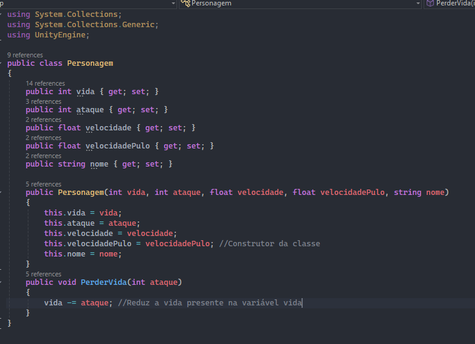

# Senhor dos Anéis: "You Shall Not Pass" - Documentação  

   
<table>  
  <tr>  
    <td>  
      
Projeto desenvolvido por Igor Michelini e Gabriel Lima. Este jogo recria a cena de *Senhor dos Anéis* onde Gandalf enfrenta o Balrog na ponte de Khazad-dûm. O objetivo é trazer mecânicas inspiradas na magia e na ação da cena original.
  
      
Agradecimentos ao Daniel Carvalho que ajudou nas artes do jogo

    </td>  
  </tr>  
</table>  
   

## Link para o Projeto
https://drive.google.com/drive/folders/1d8thGHD-2p16Pm9SXCERs-vuivXDWYjG?usp=sharing

<h1>Proposta da cena</h1>

Os heróis se encontram preso nas Minas de Moria com um dragão os perseguindo, após algum tempo de perseguição o dragão os alcança e cria um barreira de fogo para bloquear o caminho deles, porém apenas Gandalf fica preso e fala para os outros continuarem porque ele já os alcançava. Antes do dragão Gandalf precisará enfrentar alguns esqueletos que surgiram das minas.
Após uma luta difícil Gandalf derrota o dragão e vai atrás de seus amigos, chegando na ponte que eles atravessaram ele viu que eles estavam os o esperando, porém quando Gandalf chega no meio da ponte o dragão ressurge e o ataca, ele defende e com uma magia destrói a ponte, fazendo o dragão cair no abismo, mas enquanto caía o dragão consegue puxar Gandalf com sua calda fazendo ele cair junto do dragão

<h2>Personagens envolvidos</h2>

Gandalf sendo o protagonista/jogador e Balrog adaptado para ser um dragão

## Descrição do jogo  

O jogo se passa na famosa cena "You Shall Not Pass", onde Gandalf enfrenta inimigos e o chefe final, Balrog, em uma batalha épica na ponte. O jogador utiliza magias de ataque e defesa para superar os desafios enquanto enfrenta ondas de esqueletos e o Balrog. A jogabilidade combina ação e estratégia, exigindo habilidade para atacar e se defender no momento certo.
  
   

## Cena Original: "You Shall Not Pass"  

O jogo é inspirado na cena de O Senhor dos Anéis: A Sociedade do Anel, onde Gandalf enfrenta o Balrog na ponte de Khazad-dûm. Neste momento, Gandalf utiliza sua magia para proteger a Sociedade do Anel, bloqueando o avanço do Balrog com a frase "You shall not pass!" e destruindo a ponte para impedir o inimigo.
  
   

Essa cena é marcada pela coragem de Gandalf, que sacrifica sua segurança para garantir a sobrevivência do grupo. O jogo recria os desafios deste confronto épico, permitindo que o jogador controle Gandalf em sua luta contra o Balrog e outros inimigos.  

<h1>Descrição da obra</h1>

"O Senhor dos Anéis: A Sociedade do Anel" (2001), dirigido por Peter Jackson, é o primeiro filme de uma trilogia épica baseada na obra de J.R.R. Tolkien. A narrativa gira em torno da luta entre o bem e o mal, na qual um grupo de heróis improváveis deve enfrentar perigos crescentes para proteger um artefato poderoso e maligno: o Um Anel, criado pelo Senhor das Trevas, Sauron. Herdado pelo hobbit Frodo Bolseiro, o anel parece inocente, mas carrega uma maldição: quem o possui se torna corrompido por seu poder. Frodo, então, parte em uma jornada perigosa para destruí-lo, acompanhado por uma sociedade composta de hobbits, humanos, elfos e anões, cada um deles com habilidades e motivações próprias.

A ambientação da Terra Média, vasta e detalhada, é fundamental para o tom do filme, com cada local moldando a experiência emocional e os temas da história. A jornada começa no Condado, uma terra idílica e tranquila, onde a simplicidade e a paz predominam. Ali, o espectador é apresentado ao modo de vida dos hobbits, que é calmo e pastoral. As colinas verdes, os jardins floridos e as casas construídas em tocas reforçam a inocência e a beleza de uma vida que desconhece o peso do mal, representando a pureza que Frodo carrega ao iniciar sua missão.

O contraste surge quando a jornada avança e o grupo alcança lugares marcados pelo poder e mistério de suas culturas. Rivendell, por exemplo, é um refúgio mágico dos elfos, escondido em um vale cercado por montanhas e florestas, onde as construções parecem crescer organicamente das árvores e da rocha. A cidade é repleta de elegância e beleza etérea, representando a sabedoria e a imortalidade dos elfos. A arquitetura esculpida em arcos delicados, as pontes que cruzam riachos cristalinos e as cores suaves criam um ambiente de serenidade e introspecção, um contraste com as tribulações da guerra que se desenrola fora de suas fronteiras.

À medida que a Sociedade se embrenha nas profundezas das Minas de Moria, a atmosfera muda drasticamente. As minas são escuras, opressivas e desertas, com enormes salões e escadas desgastadas pelo tempo, simbolizando a grandiosidade e a decadência de um império anão que já foi poderoso. A escuridão das minas é inquietante, cheia de sombras e de ameaças ocultas. Cada som ecoa de forma sinistra, criando uma sensação de perigo iminente enquanto a Sociedade é confrontada por criaturas malignas, como os orcs e o temível Balrog, uma antiga criatura de fogo e sombras que transforma o ambiente num campo de batalha infernal. Moria não é apenas um cenário de ação, mas uma representação da fragilidade das civilizações e o custo da ganância e do poder.

Após a tensão e o caos de Moria, o grupo chega a Lothlórien, o reino dos elfos governado por Galadriel, onde a atmosfera é de calma sobrenatural. Lothlórien é uma floresta mágica, com árvores gigantescas nas quais os elfos vivem em harmonia com a natureza. A luz do lugar é suave e prateada, com uma qualidade mística, que reflete a imortalidade dos elfos e o caráter etéreo de Galadriel, que exerce uma presença quase divina. O local parece suspenso no tempo, oferecendo um breve momento de paz e reflexão para os personagens, que aqui ganham visão da magnitude de sua missão.

Em Amon Hen, o filme atinge um novo nível de tensão. Com as ruínas antigas e as vistas amplas da paisagem, o local proporciona um terreno para a emboscada e luta contra os orcs, que colocam à prova a resistência e a coragem dos membros da Sociedade. Aqui, o poder do Um Anel começa a exercer uma influência mais forte, causando a ruptura entre os membros do grupo, simbolizando o desafio contínuo de resistir ao poder e ao medo.

Cada um desses cenários, cuidadosamente projetados e filmados nas paisagens grandiosas da Nova Zelândia, contribui para o impacto visual e emocional do filme. A beleza e a selvageria das paisagens reforçam a luta da Sociedade em proteger algo puro contra a escuridão crescente, e o filme, aclamado tanto por sua narrativa quanto por seus efeitos visuais inovadores, explora temas de amizade, sacrifício e coragem ao longo de cada passo da jornada.

<h2>Teoria das cores dos personagens</h2>

<h5>1. Cores Associadas aos Personagens</h5>
Frodo e a Compaixão: Frodo é frequentemente vestido em tons de verde e azul, simbolizando esperança, natureza e calma. Essas cores refletem sua conexão com a Terra e sua pureza de coração.
Aragorn e a Herança: As roupas de Aragorn, geralmente em tons escuros como marrom e verde-escuro, representam sua ligação com a terra e seu papel como guardião. Essas cores também transmitem sua luta interna e a sombra de seu passado.
Legolas e a Luz: Legolas é associado a cores mais claras, como o branco e o azul, que evocam a ideia de graça e a etérea beleza dos elfos. Isso reforça sua natureza quase sobrenatural.

<h5>2. Cores e Ambientes</h5>
O Condado: O Condado é retratado com cores vibrantes e saturadas, como verdes e amarelos, simbolizando a paz e a tranquilidade da vida hobbit. Essa paleta é contrastada com os tons mais sombrios e desaturados que aparecem em locais como Mordor.
Mordor: As cores escuras e opressivas, como cinzas e negros, criam uma atmosfera de desolação e medo. O uso de fumaça e fogo em tons avermelhados enfatiza a destruição e o mal.

<h5>3. Cores e Temas</h5>
Luta entre o Bem e o Mal: As cores também são usadas para representar a luta entre o bem e o mal. Os Nazgûl, por exemplo, são frequentemente associados a cores escuras e frias, enquanto a Sociedade é envolta em cores mais quentes e luminosas, refletindo a esperança.
Mudança e Crescimento: À medida que a jornada avança, os personagens mudam e suas cores também se ajustam. Por exemplo, Gandalf começa como "Gandalf, o Cinzento" e se transforma em "Gandalf, o Branco", simbolizando sua evolução e poder renovado.

<h5>4. Uso Simbólico de Cores</h5>
Vermelho e Ouro: Esses tons aparecem em momentos significativos, como em batalhas, simbolizando tanto a violência quanto a bravura. O ouro, especialmente, é associado ao poder e à corrupção, refletindo o impacto do Anel.
Cores da Natureza: O uso de cores que representam a natureza, como o verde e o marrom, reforça a conexão dos hobbits e de outros personagens com suas raízes e a importância de proteger o mundo natural.

<h2>Teoria das cores do ambiente</h2>

<h5>1. Cores do Ambiente</h5>
Cores Frias e Sombras: A cena ocorre em um ambiente subterrâneo, onde predominam tons escuros e frios, como cinzas e azuis. Essas cores criam uma atmosfera opressiva e ameaçadora, refletindo a presença do Balrog e o perigo iminente que Gandalf e a Companhia enfrentam.
Iluminação Dramática: A iluminação é esmaecida, com focos de luz que acentuam o contraste entre os personagens e o fundo. Isso reforça a sensação de claustrofobia e urgência, destacando a luta entre a luz e a escuridão.

<h5>2. Cores dos Personagens</h5>
Gandalf: Gandalf é frequentemente retratado em tons de cinza e branco. Nesta cena, a transição de Gandalf de "Gandalf, o Cinzento" para sua forma mais poderosa é simbolizada por seu manto cinza, que contrasta com a escuridão ao seu redor. A luz que emana dele, especialmente quando ele enfrenta o Balrog, simboliza a resistência e a esperança.
Balrog: O Balrog é uma figura envolta em chamas e sombras, com tons de vermelho, laranja e preto. Essas cores transmitem a natureza infernal e destrutiva da criatura, simbolizando o mal e a corrupção. O contraste entre as cores do Balrog e as de Gandalf acentua a luta entre o bem e o mal.

<h5>3. Simbolismo das Cores</h5>
Conflito entre Luz e Escuridão: A luta entre Gandalf e o Balrog é, em grande parte, uma batalha entre luz e escuridão. A paleta de cores representa essa dualidade: a luz brilhante que Gandalf emite contra as chamas sombrias do Balrog. Esse simbolismo visual intensifica a gravidade da situação.
Cores como Representação de Poder: Quando Gandalf diz "You Shall Not Pass", a iluminação ao seu redor parece se intensificar, simbolizando sua determinação e poder. A explosão de luz representa não apenas sua força, mas também sua coragem em face do perigo.

<h5>4. Impacto Emocional</h5>
Tensão e Medo: As cores escuras e a presença do Balrog criam uma sensação de medo e tensão. O espectador sente a gravidade da situação, e a paleta de cores ajuda a transmitir a urgência da luta pela sobrevivência.
Esperança e Sacrifício: A luz que Gandalf emana, mesmo em meio à escuridão, representa esperança. Sua decisão de enfrentar o Balrog é um ato de sacrifício que, embora trágico, simboliza a luta pelo bem maior.

 
<h1>Esboço da cena</h1>

<h2>Menus</h2>  

### Menu Principal  

O menu principal do jogo apresenta uma imagem de Gandalf e os anões caminhando pelas montanhas. Ele possui dois botões: "Jogar" para iniciar o jogo e "Sair" para fechar o jogo.

- **Botões**: "Jogar" (inicia o jogo) e "Sair" (fecha o jogo).  
- **Imagem de fundo**: Gandalf e os anões caminhando pelas montanhas, remetendo a sensação de aventura do filme.

<table>  
<thead>  
  <th>  
    
  
  </th>  
</thead>  
</table>  

### Menu de Vitória  

Quando o jogador completa a fase e vence, o menu de vitória aparece com uma imagem de Gandalf, destacando sua conquista. A mensagem "Você Ganhou" é exibida, e o botão "Voltar" permite que o jogador retorne ao menu principal.

- **Mensagem**: "Você Ganhou"  
- **Botão**: "Voltar" (retorna ao menu principal).  
- **Imagem de fundo**: Uma imagem de Gandalf, simbolizando sua vitória após derrotar o Balrog.

<table>  
<thead>  
  <th>  
    
  
  </th>  
</thead>  
</table>  

## Músicas:
 - Menu Principal: Great Grey Wolf Sif, Dark Souls 1.
 - Jogo: Unstoppable Force - Ultrakill.
 - Vitória: Soul of Cinder - Dark Souls 3.
### Sons:
 - Parry: Efeito de parry do jogo Nine Sols.

## Mecânicas  

- **Magia de Ataque**: Gandalf pode lançar bolas de fogo que causam dano aos inimigos.  
- **Escudo de Magia**: Uma magia defensiva que reflete projéteis na direção oposta.  

## Inimigos  

- **Esqueleto Arqueiro**: Atira flechas na direção de Gandalf, exigindo que o jogador use o escudo para refletir ou desvie.  
- **Esqueleto Guerreiro**: Corre na direção de Gandalf para atacá-lo, exigindo atenção e reação rápida.  

## Chefe Final  

- **Balrog**: O chefe da fase lança bolas de fogo como ataque principal. O jogador precisa combinar o uso do escudo e de saltos precisos para desviar dos projéteis e atacar nos momentos de oportunidade.  

## Programação  

### Classes Criadas  

#### **Personagem**  
Gerencia os atributos do personagem, incluindo:  
- **Atributos**: Dano, vida, velocidade, entre outros.  
- **Métodos**:  
  - **Construtor**: Define os valores iniciais do personagem.  
  - **PerderVida**: Reduz a vida do personagem com base no dano recebido.  

##### **Print da Classe Personagem**  
<table>  
<thead>  
  <th>  
    [Personagem] 
  </th>  
</thead>  
</table>  

#### **Projétil**  
Controla as características dos projéteis, incluindo:  
- **Atributos**: Dano e velocidade de movimento.  
- **Métodos**:  
  - **OnTriggerEnter2D**: Detecta colisões e chama o método CausarDano.  
  - **Defendido**: Reverte a velocidade do projétil, fazendo-o voltar na direção oposta.  
  - **CausarDano**: Aplica dano ao personagem atingido.  

##### **Print da Classe Projétil**  
<table>  
<thead>  
  <th>  
      [Projetil]
  </th>  
</thead>  
</table>  

## Outros Scripts  

### Script do Chefe (Balrog)  
Controla o comportamento e os ataques do Balrog, incluindo os projéteis e a movimentação durante o combate.  

### Gerenciador do Jogo  
Script responsável pela transição de cenas, gerenciamento de pontuação e controle do fluxo do jogo.  

### Projétil Inimigo  
Controla a trajetória e o comportamento dos projéteis disparados pelos esqueletos.  

### Script do Player  
Gerencia os movimentos e ações de Gandalf, incluindo ataques e uso do escudo.  

### Barra de Vida  
Script responsável por atualizar e controlar a barra de vida do personagem.  

### Script do Inimigo  
Gerencia o comportamento dos esqueletos, incluindo sua movimentação e ataques. 

## Elementos Gráficos e Visuais  

### Cenário (Caverna)  

O cenário do jogo é ambientado em uma caverna subterrânea, inspirada nas Minas de Moria, com paredes rochosas e iluminação suave que evoca o clima de claustrofobia e tensão. O fundo apresenta detalhes como estalactites, pedras e um ambiente sombrio, perfeito para a batalha épica entre Gandalf e o Balrog.  

<table>  
<thead>  
  <th>
    
  
  </th>  
</thead>  
</table>  

### Sprites em Pixel Art  

- **Gandalf**: O personagem principal, Gandalf, é representado por um sprite pixel art, com seu manto e bastão, fiel à sua aparência nos filmes.  
- **Escudo de Gandalf**: O escudo de Gandalf é um item visualmente simplificado, que reflete os projéteis inimigos, com uma textura brilhante.
- **Esqueleto Arqueiro**: O esqueleto arqueiro é retratado com um arco, atirando flechas de forma contínua até que Gandalf o derrote.
- **Flechas dos Esqueletos**: As flechas disparadas pelos esqueletos arqueiros têm um design simples ara facilitar a identificação.  
- **Projétil de Magia Azul**: A bola de fogo de Gandalf, usada para ataque, é desenhada em pixel art com um tom azul vívido para indicar seu poder mágico.  
- **Esqueletos Guerreiros**: O esqueleto guerreiro é representado com espadas, em um estilo pixel art, avançando em direção a Gandalf para combate corpo a corpo.  
- **Balrog (Chefe Final)**: O Balrog, o chefe final, é o d maior em estatura e desafio, representado em pixel art, com suas quentes e asas demoníacas.  

<table>  
<thead>  
  <th>  
    *Espaço reservado para as imagens*  
  </th>  
</thead>  
</table>  

### Barra de Vida  

A barra de vida do personagem aparece na parte superior da tela, representando a saúde de Gandalf durante a batalha. Quando ele é atingido, a barra diminui gradualmente.  

<table>  
<thead>  
  <th>  
    
   
  </th>  
</thead>  
</table>  

### Chão  

O chão da caverna é composto por rochas e uma textura simples, mas funcional, para garantir que o jogador tenha uma boa percepção do movimento de Gandalf durante a luta.  

<table>  
<thead>  
  <th>  
    
   
  </th>  
</thead>  
</table>  

---

## Ambientação e Paleta de Cores  

A paleta de cores do jogo foi escolhida para manter a sensação de um ambiente medieval, com tons escuros e quentes, como o vermelho e  laranja, e o cinza das pedras. A iluminação suave e as sombras criam uma atmosfera sombria, com toques de luz azul que representam o poder mágico de Gandalf. A estética do jogo é simples, com um visual pixel art que remete aos jogos clássicos, mantendo o clima medieval.  

## Gameplay do jogo (vídeo)

<table>  
<thead>  
  <th>  
    

[Gameplay](https://github.com/user-attachments/assets/d3db5cc6-e715-4a40-8125-c9159edc3ffd)

</th>  
</thead>  
</table>  

> ## Referências

### Músicas utilizadas:

[Música jogo](https://www.youtube.com/watch?v=tkLVbp0IH_E)

[Menu principal](https://youtu.be/BjEYqqjw5fM?si=w2tUWpTmk_4N_lIB)

[Música vitória](https://youtu.be/dXcwGZV5Or4?si=P6MkQdf4agqFJsfz)
